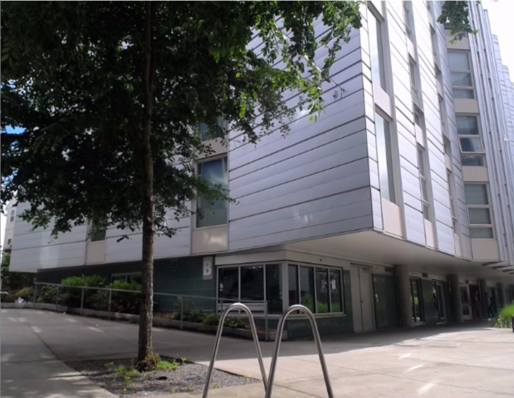
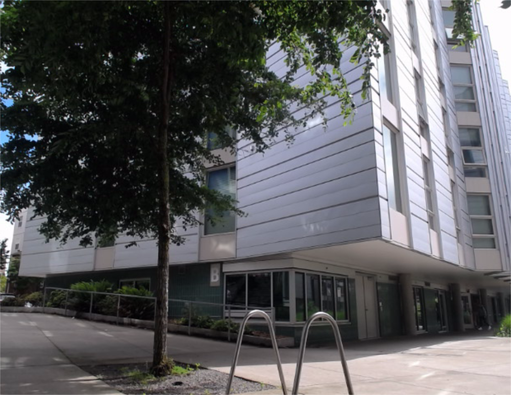
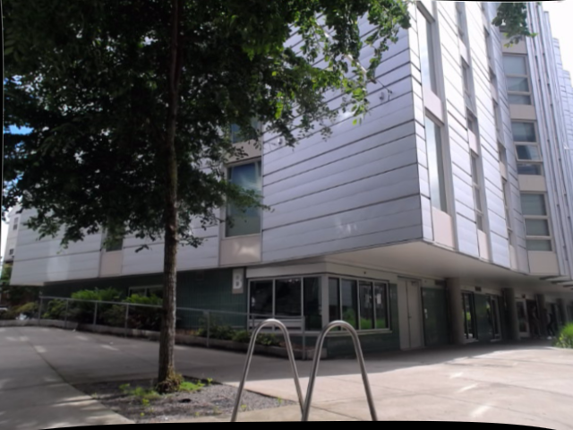

# Deep image
Extract real-time depth information from a pair of stereo images. \
Our final product is an executable that could calculate and display depth information at a clicked position in real time.

## Motivation & Problem Setup
Depth informaton are useful. We want to be able to tell how far an object is by images, which can give us more than just flat 2D information. This technology can be crucial in auto-drive, 3D environment reconstruction, and distance measurement. Certainly, there exists tools like tape measure or LIDAR that can measure depth information. However, with the help of computer vision stereo matching technique, we can achieve the same thing with equipments that normal people have in their daily life like webcams or cellphone camaras, as long as we have the parameters like distance between two cameras, field of view or focal length of the camera, and proper calibration. With our setup, we can even output depth values in real time!

We explored both the traditional methods, including stereo box match and graph cut, and neural network solutions for calculating disparity maps, and finally chose traditional stereo box match which could achieve real time depth estimation by two webcams.

## Data used
- Photos taken by ourselves
- Kitti stereo dataset
- Middlebury stereo dataset

## Technologies & techniques used
### Traditional (based on opencv, stereo box match)
#### Prereq
- numpy (`pip install numpy`)
- opencv (cv2) (`pip install opencv-contrib-python`)
- matplotlib (`pip install matplotlib`)
- gcc compiler (already installed in Linux and Mac, for Windows machines please download MinGW for gcc [here](https://www.mingw-w64.org/), for usage see .\traditional\cutil.py)
- hardwares (two cameras, recommended to use two exactly same webcams so that they can be easily connected to computers and produce same-size images with similar camera intrinsics and extrinsics)

#### Pipeline & Algorithm
- First, we caliberate our webcams individually with a 7*5 checkerboard to get their camera matrices and distortion coefficients. Then, we calibrate and rectify cameras together to deal with possible rotation and translation, and eventually make the images align perfectly on the horizontal axis. Next, we input the calibrated and rectified stereo images to OpenCV's library function to generate a disparity map, which contains the pixel difference of each pixel in the left image. We compute the depth of each pixel based on its shift, combining with the baseline and field of view of the cameras. Finally, we output the depth information by allowing users to click on the left image and print out the depth value of the corresponding position.
- Let's go through the disparity to depth algorithm. Here is a figure showing what we know and what are unknown:     


- Typically, we know focal length, two cameras' distance (called displacement or baseline), and pixel's shift. We want to compute the vertical distance. To construct similar triangles, we do the following geometry trick:\


- By shifting the blue line left, we construct a parallelogram. By the property of parallelogram, we know the bottom displacement is equal to the upper displacement. Now, we can see a pair of similar triangles:\


- By the property of similar triangles, we know `focal length / pixel shift = vertical distance / displacement` . Note that the height of the bigger triangle should be vertical distance plus focal length, but given that focal length is too small compared to actual distance, we can safely ignore it. As a result, we can have a nice formula: `vertical distance = focal length * displacement / pixel shift`
- But wait! Is the vertical distance real distance? Actually, the name "vertical distance" indicates that it's just the distance along z-axis, which is shorter than the actual distance (should be the length of the red line). How can we know the actual distance?    


- Again, resort to similar triangles! Now we have two similar triangles. As long as we know the red, short bold lines, we can know the real distance.
- Let's change our point of view. Supppose now we look at the image normally:     


- We know the line connecting focal point and the center of the image is vertical to the image, and the length of this line is just our focal length. We can also know the distance of a pixel to image center. Now, we can use these values to compute distance from focal point to the pixel, which is just the thing we want, by Pythagorean Theorem.
- That's how we compute the real depth of a pixel!

#### How to Run Our Program
- Run python tk_capture.py to start the application.
- Input the baseline and field of view values according to your cameras.
- Click on the point of interest in the left image and read the depth value in the bottom right corner.

#### Challenges we ran into
- Calibration: The calibration step was tricky. At the beginning, we used the same set of images for calibrating individual cameras and calibrating both cameras. It did not work well. The images got zoomed in wierdly after rectification and they were not aligned perfectly horizontally. To deal with the problem, we decided to shoot different sets of images for calibrating individual cameras, and we used the png format instead jpg when saving images. We later found out the checkerboard was crucial as well. We did not succeed in one go because we did not make sure we had different angles and positions when we held the checkerboard. After shooting about 25 images for each calibration, we got a pretty good result.

| Left | Right |
|:-------------------------:|:-------------------------:|
| Original Left |   Original Right 
| Calibrated Left | Calibrated Right |

- Disparity Map: Having texture in the images is important for genereating a good disparity map. When we tried to calculate the depth indoor with a lot of repetitive patterns and insufficient lighting, we got extremely unstable disparity maps and thus making our depth display inconsistent. We played with StereoBM and StereoSGBM algorithms provided by OpenCV, tweaked the parameters like blockSize and numDisparities, and did some post-filtering, but still could not remove the noise in the disparity map.

- Graph Cut Algorithm: To generate high-quality disparity map, we also tried the graph cut algorithm. [One repo](https://github.com/NathanChenJiabin/GraphCut-Stereo-Disparity) we tested on took about 5 seconds to generate a low resolution diaparity map, which could not achieve real time. We ran [another repo](https://github.com/pmonasse/disparity-with-graph-cuts) on attu, which worked at a decent speed and had a good accuracy. However, there were not a lot of parameters that we could work with.

| First Graph Cut Repo | Second Graph Cut Repo |
|:-------------------------:|:-------------------------:|
||

#### Future Improvement
- We got a lot of noise using the OpenCV stereo disparity algorithm on our own images, resulting in a unstable real time disparity or depth map. We can write our own box matching algorithm, or deploying the graph cut algorithm in the future to see if we can fix the problem.
- We put the webcams on our computer and sometimes they got shaky, making our experiments prone to error and have little flexbility. We can diy a better equipment for our future experimentation.

#### Components from preexisting work (code from github, other libraries)

- We used OpenCV library's video capture, calibration, and disparity map functions.
- For the graph cut algorithms we used codes from the github repos linked above.

#### Components implemented for the project (new code)

- We implemented the disparity to depth algorithm with C and then export it to Python.
- We also implemented the user interface with tkinker.

### Neural Network (utilized [MobileStereoNet](https://github.com/cogsys-tuebingen/mobilestereonet))
After exploring the open sourced codebases from the top 100 Kitti stereo dataset benchmark, we choose to test on MobileStereoNet. Specifically for this project, we utlized three versions of pretrained versions of 3D-MobileStereoNet that are trained on (SF only), (SF then finetuned on DS), (SF then finetuned on DS and KITTI2015). (available on the github page for [MobileStereoNet](https://github.com/cogsys-tuebingen/mobilestereonet))

SF: Scene Flow, DS: Driving Stereo

#### Prereq
Follow the readme for [MobileStereoNet](https://github.com/cogsys-tuebingen/mobilestereonet), then used the tweaked version of [prediction.py](neural_network/prediction.py) (credits to the authors of MobileStereoNet), and visualize script written by us [visualize_disparity.py](neural_network/visualize_disparity.py) that converts npz real disparity maps into visible png images.

The command to run the predition is
 ```shell
 python prediction.py --datapath ./ --testlist ./filenames/own_test.txt --loadckpt {YOUR CKPT PATH} --dataset kitti --colored 0 --model MSNet3D
 ```

#### Challenges we ran into
- We originally intended to train our own version of model for a preexisting codebase with different training parameters. However, most open source stereo matching depth estimation codebase are specialized for dataset benchmarks and don't have many options to tweak the training parameters.
- In addition, the huge number of training data from datasets like Scene Flow, Driving Stereo, and Kitti would be extremely time consuming to train.
- With no cuda acceleration, the prediction process for a pair of images would take about 10 to 20 seconds which is far from running in real time at the miliseconds level.
- As mentioned above, most codebase are specialized for benchmark and it is hard to run custom pairs of images. For mobilestereonet, it requires input image to be less than 1248x384.
- It is also hard to find out what is the actual disparity value in pixels, since output is often colorized with no standards. One reason we choose this codebase is that it's relavely easy to extract out the real disparity map.
- In the end, we decided to run an experiment on how well the models produced by training on different datasets peforms on five pairs of various types of images, based on what we've learned in class and our knowledge of the dateset used for training.

#### The experiment
The input images are in the img folder.
- Chess, and Hall are indoor scene from Middlebury dataset
- Kitchen is photo taken by ourselves
- Kitti is from the Kitti dataset
- Scene is a 3d model rendered scene from University of Tsukuba

**Input left image preview**
| Chess                       | Hall                      | Kitchen                         | Kitti                       | Scene                       |
|-----------------------------|---------------------------|---------------------------------|-----------------------------|-----------------------------|
|  |  |  |  |  |

Output disparity maps (note that they do not scale by the same scalar from the real disparity in pixels)
**Chess**
| SF                                               | SF+DS                                              | SF+DS+KITTI2015                                         |
|--------------------------------------------------|----------------------------------------------------|---------------------------------------------------------|
|  |  |  |

**Hall**
| SF                                               | SF+DS                                              | SF+DS+KITTI2015                                         |
|--------------------------------------------------|----------------------------------------------------|---------------------------------------------------------|
|  |  |  |

**Kitchen**
| SF                                               | SF+DS                                              | SF+DS+KITTI2015                                         |
|--------------------------------------------------|----------------------------------------------------|---------------------------------------------------------|
|  |  |  |

**Kitti**
| SF                                               | SF+DS                                              | SF+DS+KITTI2015                                         |
|--------------------------------------------------|----------------------------------------------------|---------------------------------------------------------|
|  |  |  |

**Scene**
| SF                                               | SF+DS                                              | SF+DS+KITTI2015                                         |
|--------------------------------------------------|----------------------------------------------------|---------------------------------------------------------|
|  |  |  |

**Observations & Possible Explanations**
- For chess and hall images, SF model performs much better compared to SF+DS and SF+DS+KITTI2015 in terms of revealing more close up depth details like the chess pieces, the chair, and folded up chair in the hall. We guess that this happens because DS and KITII2015 are both stereo datasets for driving with pictures on the streets where items are far away and have less disparity in pixels movement compared to more closed up objets, which makes the later two models only sensitive to blocks of far away objects.
- For the kitchen image taken by ourselves, three models all failed to produce a clear disparity output. Our guess is that the white light bar type of object is not present in all three datasets, making the models having a hard time to predict the disparity of the closets near the light bar.
- For the kitti image, SF+DS+KITTI2015 performs the best in reavealing the most details like the trees. It's expected since this image is from the kitti testing, and is similar to the training data in kitti.
- For the scene image, SF model performs the best, we can see the statue, the lamp, the camera, the cans and even some not so clear bookshelf. It's also reasonable because Scene Flow Dataset has FlyingThings3D that are similar 3D rendered scenes.

#### Components from preexisting work (code from github, other libraries)

- For the neural network part, we used code from [MobileStereoNet](https://github.com/cogsys-tuebingen/mobilestereonet)

#### Components implemented for the project (new code)

- For the neural network part, we wrote a new script to visualize disparity maps ([visualize_disparity.py](neural_network/visualize_disparity.py))

## What we've learned & other thoughts
- Neural Networks could achieve a lot in the field of Computer Vision, but for the specific task of stereo depth estimation, images that are not driving street photos may not get an accurate output due to the limitation of the dataset not having much indoors training images. If we want to achieve better results for indoor images, we may need to finetune on an indoor focused stereo dataset after pretraining on Scene Flow.
- We learned the most by troubleshooting, trying out different algorithms, experimenting with various parameters, and analyzing a neural network trained on different datasets.
